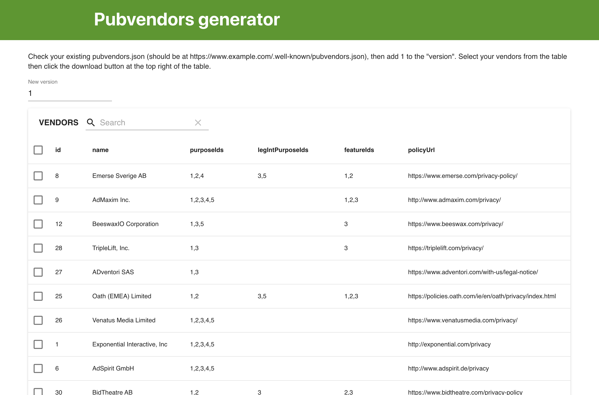

# pubvendors-tool

Simple gatsby app that lets non-devs generate a new pubvendors.json that is needed for new IAB compliant cookie-consent solutions. See https://github.com/InteractiveAdvertisingBureau/GDPR-Transparency-and-Consent-Framework.

It loads the default global vendor list from https://vendorlist.consensu.org/vendorlist.json and lets users pick which vendors they want to export into a new pubvendors.json file.

Built with gatsbyjs.